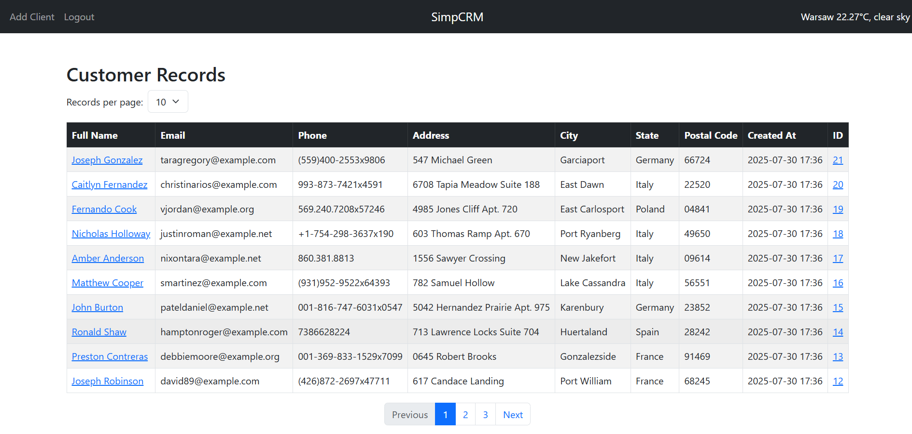
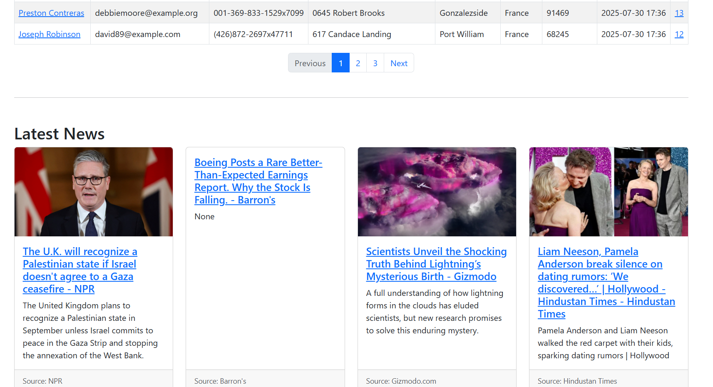
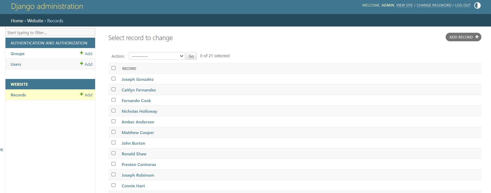

# SimpCRM – Simple Django-based CRM system

SimpCRM is a lightweight CRM (Customer Relationship Management) system built with Django. It allows you to manage clients, log in/out, register users, browse news and weather updates, and integrate holiday information. The app also includes full unit test coverage.

## Features

- User authentication (login, logout, registration)

- Client list with pagination (10/20/50 per page)

- Add, edit, delete client records

- Unit tests for:

    Forms and views

    Authentication

    Client CRUD operations

- Clean, Bootstrap 5-based UI
- `.env` support for environment-specific settings

## Additional Functionality

### Weather Widget
- Automatically fetches and displays current weather in Warsaw.
- Uses external API (e.g., OpenWeatherMap) – API key stored securely in `.env`.

### Holiday Widget
- Automatically fetches and displays current holidays in Poland.
- Uses external API (e.g., HolidayAPI) – API key stored securely in `.env`.

### News Feed
- Displays recent news headlines in a compact sidebar or homepage section (4 per row, 3 rows, with pagination).
- Configurable to use RSS, JSON feeds or third-party API.
- Uses external API (e.g., NewsAPI) – API key stored securely in `.env`.

Above features are integrated directly into the homepage and styled to match the app design.


## Tech Stack

- Python 3.12
- Django 5.2.4
- Bootstrap 5
- SQLite (default)
- External holiday, weather and news APIs
- HTML5 / CSS3

---

## Local Setup Instructions

### 1a. Unpack and Open the Project
```
Download and unzip the project archive. Open the extracted folder in your preferred IDE (e.g., Visual Studio Code).
```
#### OR
```
### 1b. Clone the repository
```
git clone https://github.com/d-kudin/SimpCRM.git
cd SimpCRM
```

### 2. Create and Activate a Virtual Environment
```
python -m venv venv
venv\Scripts\activate  # Windows
source venv/bin/activate  # Linux / macOS
```

### 3. Install Dependencies
```
pip install -r requirements.txt
```

### 4. Configure Environment Variables
```
Write your API keys to the file .env instead of:
your_secret_key
your_openweather_api_key
your_news_api_key
your_holiday_api_key

```
Where to get the API keys?
```

Django SECRET_KEY:
Generate a strong key using:

python -c "from django.core.management.utils import get_random_secret_key; print(get_random_secret_key())"

Or visit: https://djecrety.ir

OpenWeatherMap (weather data):
Sign up at https://openweathermap.org → Profile → API Keys

NewsAPI (headlines):
Register at https://newsapi.org → Dashboard → Your API key

HolidayAPI (holidays):
Register at https://holidayapi.com → Dashboard → Your API key
```

### 5. Apply Migrations
```
python manage.py migrate
```

### 6. Create Superuser Account
```
python manage.py createsuperuser
```

### 7. Run the Development Server
```
python manage.py runserver
```

Frontend:  
**http://127.0.0.1:8000/**

Backend:
**http://127.0.0.1:8000/admin**

---

## Example Admin Credentials

- Login: **admin**
- Password: **MyPassword1234@**

---

## Run Tests (All unit tests should pass)
---
python manage.py test
---

## Additional Notes
Default database: SQLite (db.sqlite3)

Sensitive data like API keys must be stored in .env

If holidays/weather/news display incorrectly, verify your API keys and internet connection. 

**FRONTEND:**



**BACKEND:**

